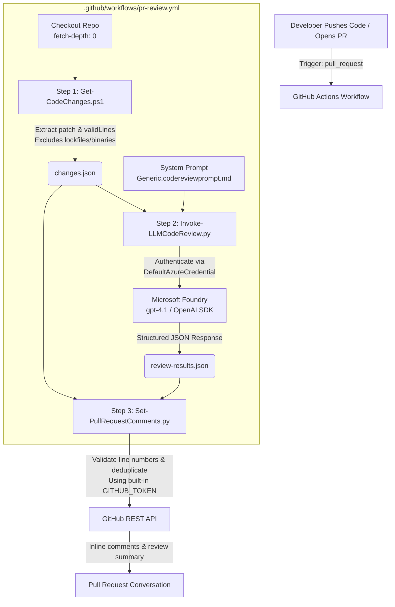

## This is AJ

# Automated AI Code Reviews with Microsoft Foundry & GitHub Actions

An event-driven AI code review pipeline inside **GitHub Actions**, powered by **Microsoft Foundry (`gpt-4.1`)** via the `OpenAI` Python SDK with native `DefaultAzureCredential()` authentication.

Adapted from [Automated Code Reviews using OpenAI Models Powered by Microsoft Foundry](https://johnlokerse.dev/2026/01/06/automated-code-reviews-in-azure-devops-using-openai-models-powered-by-microsoft-foundry/), this project implements a strict separation of concerns across three modular scripts:

```
Developer Push → Pull Request Event (.github/workflows/pr-review.yml)
      │
      ├─► Step 1: Get-CodeChanges.ps1        (Extract Git diff & compute valid line numbers)
      ├─► Step 2: Invoke-LLMCodeReview.py    (Call Microsoft Foundry gpt-4.1 with JSON schema)
      └─► Step 3: Set-PullRequestComments.py (Post inline comments & summary banner via GitHub API)
```

---

## 🏗️ Architecture & Flow



### Why 3 Modular Scripts instead of One Huge Script?
Each script adheres to the **Single Responsibility Principle**:
1. **`Get-CodeChanges.ps1` (Data Preparation):** Performs `git diff origin/base...HEAD`. Filters out high-entropy files (`package-lock.json`, minified JS, binaries) and calculates the exact `validLines` where review comments can attach.
2. **`Invoke-LLMCodeReview.py` (AI Inference):** Combines the structured diff with externalized Markdown prompt templates (`prompts/*.codereviewprompt.md`) and calls Microsoft Foundry using strict JSON formatting.
3. **`Set-PullRequestComments.py` (Integration & Output):** Validates line numbers, checks existing threads to prevent duplicate spam across subsequent commits, and posts unified review banners using `GITHUB_TOKEN`.

---

## 🚨 Engineering Mitigations ("Fishy" Gotchas Solved)

| Potential Gotcha | Why It Fails in Naive Implementations | Our Engineered Solution |
| :--- | :--- | :--- |
| **API Line Number Rejection (`422 Unprocessable`)** | `git diff` produces hunk numbers. If an LLM returns a line not in the diff patch, GitHub rejects the API call and drops all feedback. | `Get-CodeChanges.ps1` parses unified diff headers to compute exact `validLines`. `Set-PullRequestComments.py` validates every line number before calling the API—falling back to summary notes if out-of-bounds. |
| **Duplicate Comment Spam across PR Pushes** | When a developer pushes a fix, the pipeline re-runs. Naive bots post identical comments again on line 42. | We embed a hidden marker (`<!-- ai-review: path:line -->`) inside comments. If an active review thread already exists on that location, our script skips posting a duplicate. |
| **Token & Cost Blowout** | Comparing branches with `fetch-depth: 0` can include lockfiles or 10,000 generated lines, exhausting model tokens and context limits. | Strict file exclusions (`*.lock`, `*.min.js`, `*.map`, `dist/*`) and line-count caps ensure only clean human-authored source code reaches Foundry. |
| **PAT Expiration & Security Risks** | Relying on Personal Access Tokens (PATs) for bot comments introduces secret rotation and security overhead. | Zero external PATs needed! The workflow uses GitHub Actions' built-in `${{ secrets.GITHUB_TOKEN }}` with `pull-requests: write` permission. |

---

## ⚡ Beginner-Friendly Setup (3 Minutes)

### Step 1: Create Azure AI Foundry Credentials (Fastest Option)
To allow `DefaultAzureCredential()` inside GitHub Actions to securely access your Azure AI Foundry model without complex federated setup, create a Service Principal:

1. Open your terminal (or [Azure Cloud Shell](https://shell.azure.com)) and run:
   ```bash
   az login
   
   # Replace <your-sub-id> and <your-resource-group> with your Azure AI Foundry details:
   az ad sp create-for-rbac --name ai-review-bot --role "Cognitive Services OpenAI User" --scopes /subscriptions/<your-sub-id>/resourceGroups/<your-resource-group>
   ```
2. The command will output JSON with your credentials:
   ```json
   {
     "appId": "xxxxxxxx-xxxx-xxxx-xxxx-xxxxxxxxxxxx",
     "displayName": "ai-review-bot",
     "password": "xxxxxxxxxxxxxxxxxxxxxxxxxxxxxxxxxxxx",
     "tenant": "xxxxxxxx-xxxx-xxxx-xxxx-xxxxxxxxxxxx"
   }
   ```

### Step 2: Add Secrets to Your GitHub Repository
Go to your GitHub Repository → **Settings** → **Secrets and variables** → **Actions** → **New repository secret**:

| Secret Name | Value to Paste from Command Output Above |
| :--- | :--- |
| `AZURE_CLIENT_ID` | Copy `appId` |
| `AZURE_TENANT_ID` | Copy `tenant` |
| `AZURE_CLIENT_SECRET` | Copy `password` |

That's it! When these three environment variables are set in `.github/workflows/pr-review.yml`, `DefaultAzureCredential()` automatically picks them up and connects to Azure Foundry using `gpt-4.1`.

---

## 💻 Local Testing & Verification

You can test every script directly on your personal computer before opening a Pull Request!

### 1. Zero-Config Local Authentication
If you run `az login` on your local machine, `DefaultAzureCredential()` automatically uses your active Azure CLI session! You do not even need to fill out `AZURE_CLIENT_ID` or secrets locally.

### 2. Set Up Local Environment
Copy our template environment file:
```bash
cp .env.example .env
```
*(Open `.env` and fill in any optional testing variables).*

### 3. Run the Pipeline Locally
```bash
# 1. Extract diff between feature branch and main
pwsh ./scripts/Get-CodeChanges.ps1 -SourceBranch HEAD -TargetBranch main

# 2. Invoke AI review against changes.json
python ./scripts/Invoke-LLMCodeReview.py

# 3. View output results
cat review-results.json
```
*(Note: `Set-PullRequestComments.py` requires `GITHUB_TOKEN` and an active PR number (`PULL_REQUEST_NUMBER`) if you wish to test posting comments from your local machine).*

---

## 📁 Repository Structure

```
.
├── .github/workflows/
│   └── pr-review.yml                # GitHub Actions workflow definition
├── scripts/
│   ├── Get-CodeChanges.ps1          # Powershell script: diff parsing & noise filtering
│   ├── Invoke-LLMCodeReview.py      # Python script: Azure AI Foundry OpenAI SDK invocation
│   └── Set-PullRequestComments.py   # Python script: GitHub REST API review submission
├── prompts/
│   └── Generic.codereviewprompt.md  # System prompt: Principal Software Engineer instructions & schema
├── .env.example                     # Environment variables template for local testing
├── .gitignore                       # Git ignore rules for secrets and runtime outputs
└── README.md                        # Documentation & setup guide
```
